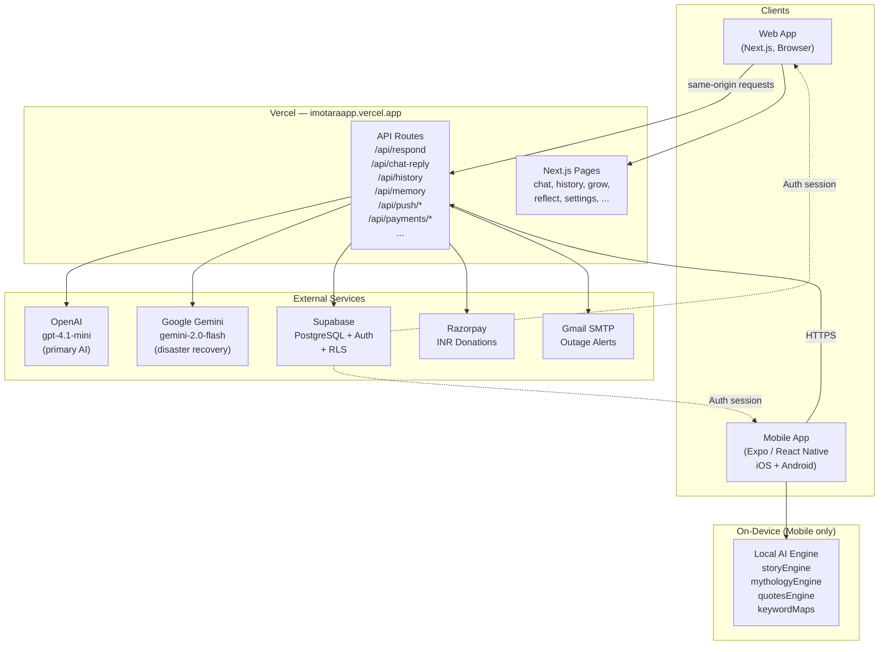
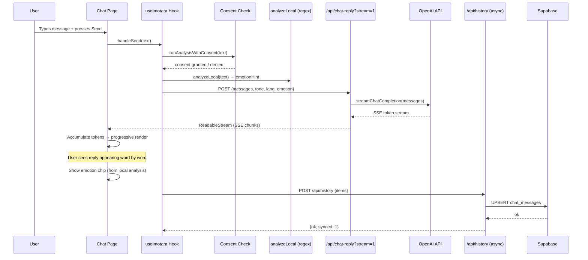
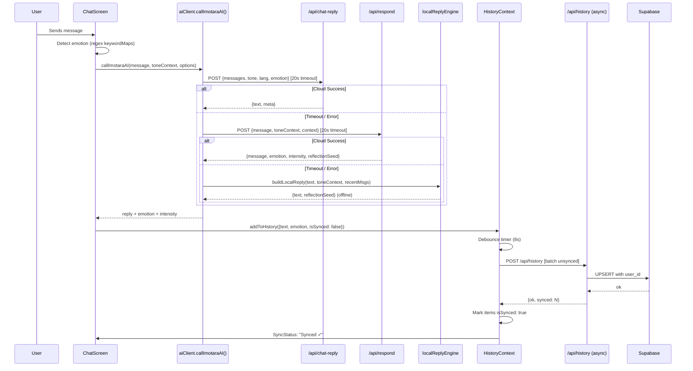
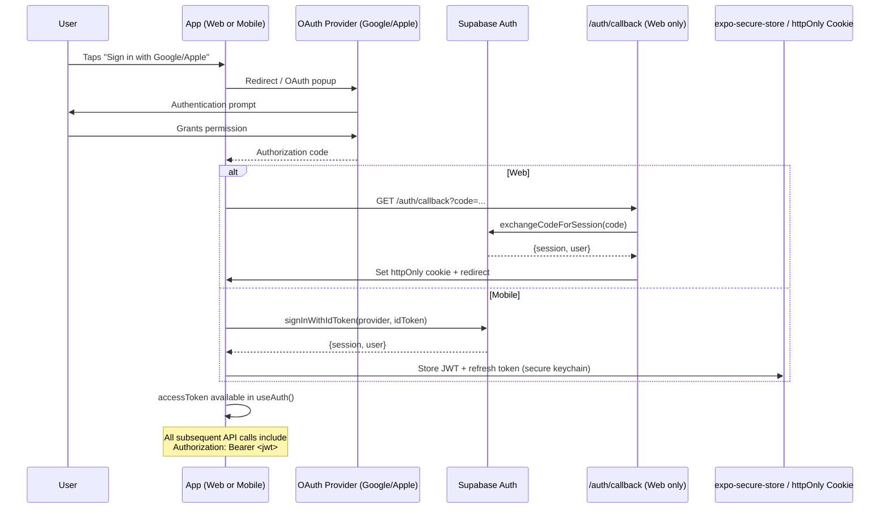
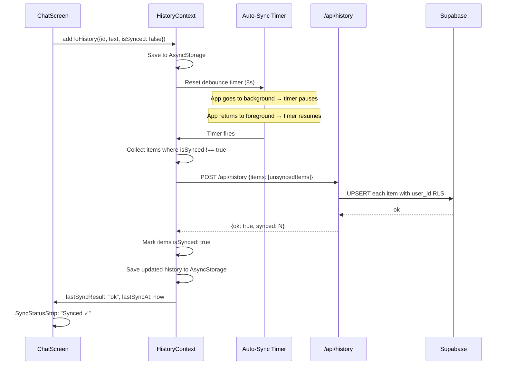
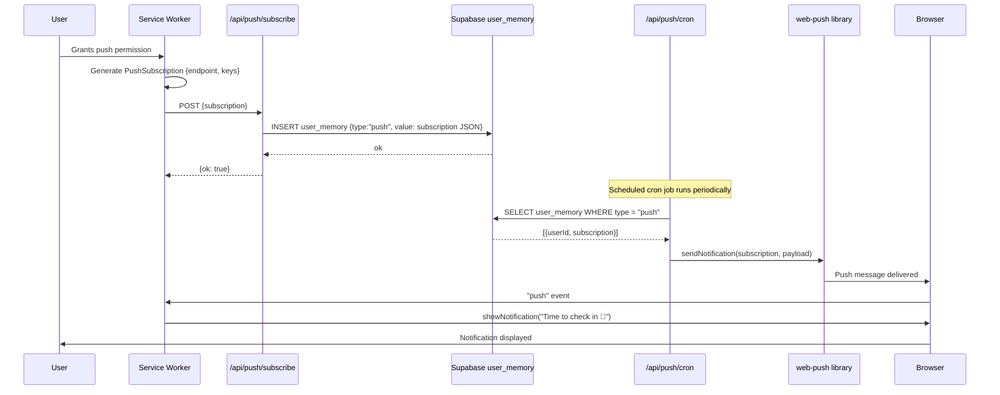
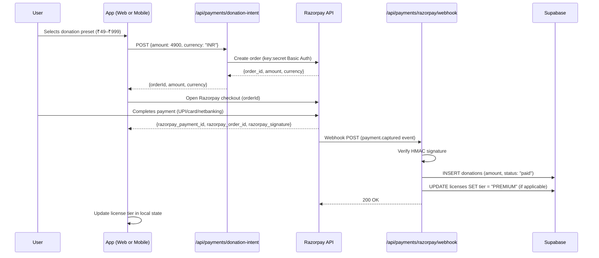
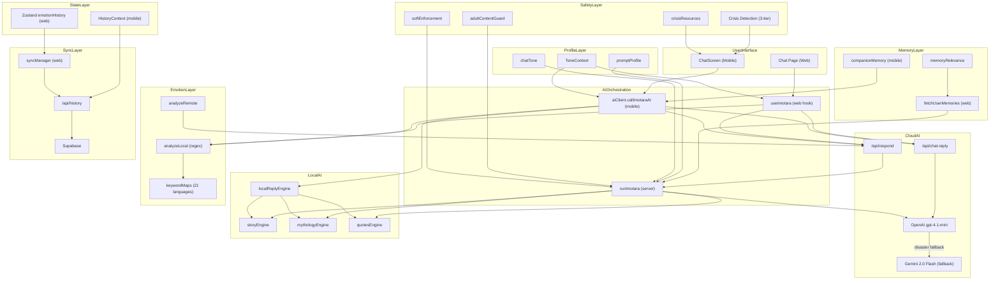
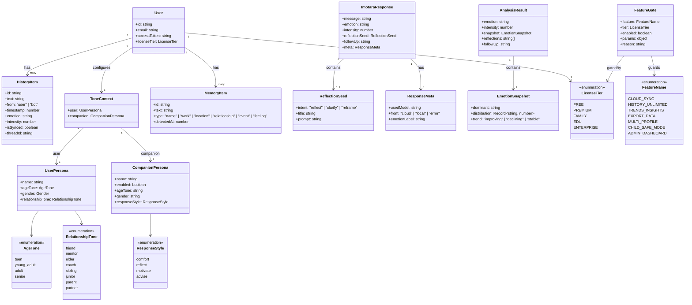

# Imotara — System Architecture Document

> Version: 1.0.6 (Build 64) · Last updated: April 2026

---

## Table of Contents

1. [Executive Overview](#1-executive-overview)
2. [High-Level System Architecture](#2-high-level-system-architecture)
3. [Technology Stack](#3-technology-stack)
4. [Web App Architecture](#4-web-app-architecture)
5. [Mobile App Architecture](#5-mobile-app-architecture)
6. [Shared Backend API](#6-shared-backend-api)
7. [Data Models](#7-data-models)
8. [Sequence Diagrams](#8-sequence-diagrams)
9. [Functional Relationships](#9-functional-relationships)
10. [Class Diagram](#10-class-diagram)
11. [Dependency Tree](#11-dependency-tree)
12. [Security Architecture](#12-security-architecture)
13. [Multilingual Architecture](#13-multilingual-architecture)
14. [Licensing & Feature Gating](#14-licensing--feature-gating)
15. [Current Constraints](#15-current-constraints)
16. [Future Enhancement Opportunities](#16-future-enhancement-opportunities)

---

## 1. Executive Overview

**Imotara** is a privacy-first AI emotional wellness companion — a calm, private space for users to talk about their feelings, track mood, and receive gentle AI support. It has no social feed, no public profiles, and no algorithmic pressure.

### Core Design Goals

| Goal | Implementation |
|------|---------------|
| Privacy-first | Offline-first with opt-in cloud sync; consent-gated analysis; no PII in AI prompts |
| Multilingual | 22 languages with native script detection + romanized fallbacks |
| Resilient | Local AI fallback when cloud unavailable; Gemini backup when OpenAI fails |
| Companion-quality | Tone personalization (relationship vibe, response style, age/gender awareness) |
| Accessible | Haptic feedback, ARIA labels, voice I/O (mobile), safe area awareness |

### Platform Summary

| Platform | Codebase | Framework | Hosting |
|----------|----------|-----------|---------|
| Web | `imotaraapp` | Next.js 16 + React 19 | Vercel |
| Mobile (iOS + Android) | `imotara-mobile` | Expo SDK 54 + React Native 0.81.5 | App Store / Play Store |
| Shared Backend | `imotaraapp` (API routes) | Next.js Route Handlers | Vercel (same deploy as web) |

Both the web app and mobile app call the **same Vercel-hosted API** (`https://imotaraapp.vercel.app/api/...`). There is no separate backend service.

---

## 2. High-Level System Architecture



### Key Architectural Principle

The web app and mobile app share **zero code at the package level** — they are separate repos. However, they share:
- The same Vercel API backend
- The same Supabase project (auth + database)
- Conceptually identical data contracts (manually kept in sync)
- Copies of `keywordMaps.ts`, `HistoryItem` types, `featureGates`, and local AI engines

---

## 3. Technology Stack

### Web vs Mobile Comparison

| Concern | Web (`imotaraapp`) | Mobile (`imotara-mobile`) |
|---------|-------------------|--------------------------|
| Framework | Next.js 16.1.6 (App Router) | Expo SDK 54 |
| UI Runtime | React 19.2.0 | React Native 0.81.5 + React 19.1.0 |
| Language | TypeScript 5.9.3 | TypeScript 5.9.2 |
| Styling | Tailwind CSS v4 + CVA | Inline StyleSheet + theme colors |
| Icons | Lucide React + Radix UI Icons | @expo/vector-icons (Ionicons) |
| State (global) | Zustand v5 | React Context (HistoryContext, SettingsContext) |
| State (local) | React hooks | React hooks |
| Storage | localStorage (client) + Supabase (server) | AsyncStorage + expo-secure-store |
| ORM | Prisma 6 (configured, minimal use) | N/A |
| Database | Supabase (PostgreSQL) | Supabase (same project) |
| Auth | Supabase Auth (@supabase/ssr) | Supabase Auth + expo-auth-session |
| AI Primary | OpenAI gpt-4.1-mini (server-side) | OpenAI via `/api/chat-reply` |
| AI Fallback | Google Gemini (server-side) | Local engines (offline) |
| Payments | Razorpay REST API | react-native-razorpay |
| Push Notifs | Web Push API + service worker | expo-notifications |
| Voice/TTS | — | expo-av (voice) + expo-speech (TTS) |
| Navigation | Next.js App Router | React Navigation v7 (bottom tabs) |
| Charts | Recharts v3 | Custom (inline bar charts) |
| Forms | React Hook Form + Zod | — |
| Testing | Vitest + tsx E2E runner | Manual / QA via debug panel |
| Build | `next build` | EAS Build (eas.json profiles) |
| Deploy | Vercel | App Store (TestFlight) + Play Store (EAS) |

---

## 4. Web App Architecture

### 4a. Directory Structure

```
imotaraapp/
├── prisma/
│   └── schema.prisma          # DB schema (minimal — Supabase manages tables)
├── public/                    # Static assets (icons, manifests, splash)
├── scripts/                   # Dev route pruning (prebuild/postbuild)
├── src/
│   ├── app/                   # Next.js App Router
│   │   ├── api/               # 17 API route handlers
│   │   │   ├── analyze/       # Emotion analysis endpoint
│   │   │   ├── chat-reply/    # GPT streaming reply
│   │   │   ├── chat/messages/ # Chat history CRUD
│   │   │   ├── respond/       # Full orchestration (analyze + reply)
│   │   │   ├── history/       # Emotion records sync
│   │   │   │   └── sync/      # Incremental pull
│   │   │   ├── memory/        # User memory CRUD
│   │   │   ├── delete-remote/ # Data deletion
│   │   │   ├── export/        # JSON/CSV export
│   │   │   ├── profile/sync/  # Profile sync
│   │   │   ├── license/       # License status + payment verify
│   │   │   ├── payments/      # Razorpay order + webhook
│   │   │   ├── donations/     # Donation records
│   │   │   ├── push/          # Web push subscribe + cron
│   │   │   └── health/        # Health check
│   │   ├── auth/callback/     # Supabase OAuth callback
│   │   ├── chat/              # Chat page (3,969 LOC)
│   │   ├── history/           # History page
│   │   ├── grow/              # Growth modules
│   │   ├── feel/              # Quick mood check-in
│   │   ├── reflect/           # Journaling
│   │   ├── settings/          # Preferences
│   │   ├── profile/           # User profile
│   │   ├── donate/            # Donation landing
│   │   ├── about/             # Mission / philosophy
│   │   ├── connect/           # Contact / partnerships
│   │   ├── privacy/           # Privacy policy
│   │   ├── terms/             # Terms of service
│   │   ├── layout.tsx         # Root layout (providers, SW, metadata)
│   │   └── page.tsx           # Landing / home (526 LOC)
│   ├── components/
│   │   └── imotara/           # Domain-specific UI components
│   ├── hooks/                 # Custom React hooks
│   ├── lib/
│   │   ├── imotara/           # Core domain logic (65+ files)
│   │   ├── ai/                # AI pipeline (response, orchestration)
│   │   ├── emotion/           # Multilingual emotion detection
│   │   ├── memory/            # User memory retrieval
│   │   └── safety/            # Crisis + content guards
│   ├── store/                 # Zustand stores
│   └── types/                 # TypeScript type definitions
├── tests/
│   └── imotara-ai/            # E2E AI language tests (14 languages)
└── vercel.json                # Vercel deployment config
```

### 4b. Page Inventory

| Route | Approx LOC | Purpose |
|-------|-----------|---------|
| `/` | 526 | Landing hub — nav to features, launch offer banner, onboarding CTA |
| `/chat` | 3,969 | Core conversation UI — streaming AI replies, emotion tagging, threads |
| `/history` | 473 | Emotion timeline — pie chart, export/delete, emotion filter |
| `/grow` | 1,559 | Growth modules — reflection prompts, seasonal themes, insights |
| `/feel` | 244 | Quick mood input — emotion selector + intensity slider |
| `/reflect` | 45 | Dedicated journaling / reflection mode |
| `/settings` | 1,916 | Preferences — tone, language, consent, companion, data management |
| `/profile` | 76 | User info + companion customization |
| `/donate` | 209 | Donation landing — Razorpay presets (₹49–₹999) |
| `/connect` | 284 | Contact form, social links, partnership info |
| `/about` | 136 | Mission statement, app philosophy |
| `/privacy` | 372 | Privacy policy + data practices |
| `/terms` | 173 | Terms of service |
| `/auth/callback` | — | Supabase OAuth code → session exchange |
| `/license-debug` | — | QA-only license tier inspection |

### 4c. API Routes

| Method | Path | Auth | Purpose | Key Dependencies |
|--------|------|------|---------|-----------------|
| POST | `/api/analyze` | Optional | Emotion analysis (local or cloud) | `runImotara`, `analyzeLocal` |
| POST | `/api/chat-reply` | Optional | GPT reply, SSE streaming support | `aiClient` (OpenAI → Gemini) |
| POST | `/api/respond` | Optional | Full orchestration: analyze + reply + reflection | `runImotara`, `aiClient` |
| GET | `/api/chat/messages` | Bearer/Cookie | Fetch chat history | Supabase |
| POST | `/api/chat/messages` | Bearer/Cookie | Store chat messages | Supabase |
| GET | `/api/history` | Bearer/Cookie | Fetch emotion records (with cursor) | Supabase |
| POST | `/api/history` | Bearer/Cookie | Upsert emotion records (batch) | Supabase |
| DELETE | `/api/history` | Bearer/Cookie | Delete emotion records | Supabase |
| POST | `/api/history/sync` | Bearer/Cookie | Pull remote changes since last sync token | Supabase |
| GET | `/api/memory` | Bearer/Cookie | Fetch user memories | Supabase `user_memory` |
| POST | `/api/memory` | Bearer/Cookie | Save/update a memory | Supabase |
| DELETE | `/api/memory` | Bearer/Cookie | Delete a memory | Supabase |
| POST | `/api/delete-remote` | Bearer/Cookie | Delete all user cloud data | Supabase |
| POST | `/api/export` | Bearer/Cookie | Export user data as JSON/CSV | Supabase |
| POST | `/api/profile/sync` | Bearer/Cookie | Sync user profile preferences | Supabase auth metadata |
| GET | `/api/license/status` | Optional | Get license tier + trial status | Supabase `licenses` |
| POST | `/api/license/verify-payment` | Bearer | Verify payment → upgrade tier | Supabase, Razorpay |
| POST | `/api/payments/donation-intent` | Optional | Create Razorpay donation order | Razorpay REST API |
| POST | `/api/payments/razorpay/webhook` | Webhook sig | Handle payment confirmation | Razorpay, Supabase |
| GET | `/api/donations/recent` | None | Fetch recent donations (leaderboard) | Supabase |
| POST | `/api/push/subscribe` | Bearer/Cookie | Save push subscription | Supabase `user_memory` |
| DELETE | `/api/push/subscribe` | Bearer/Cookie | Remove push subscription | Supabase |
| GET | `/api/push/cron` | Cron secret | Send scheduled push notifications | web-push, Supabase |
| GET | `/api/health` | None | Health check (env present, no secrets) | — |

### 4d. Core Library Modules

#### AI Pipeline (`src/lib/imotara/` + `src/lib/ai/`)

| File | Purpose |
|------|---------|
| `aiClient.ts` | OpenAI client with Gemini fallback; streaming support; disaster recovery (Gmail alert, 5-min cooldown) |
| `runImotara.ts` | Main AI orchestrator — emotion analysis → response blueprint → story/quote/mythology enrichment → final formatting |
| `analyze.ts` | Wrapper: routes to local or remote analysis based on consent + mode |
| `analyzeLocal.ts` | Regex-based emotion detection (no API call, pure offline) |
| `analyzeRemote.ts` | Calls `/api/respond` for cloud-powered analysis |
| `runAnalysisWithConsent.ts` | Privacy-aware gate: only analyzes if consent given |
| `runRespondWithConsent.ts` | Gated AI response generation |
| `respondRemote.ts` | Remote response via `/api/respond` |
| `responseBlueprint.ts` | Response tone config: calm / supportive / coach / practical; reflection seed config |
| `getResponseBlueprint.ts` | Dynamically chooses blueprint from emotion + context |
| `storyEngine.ts` | Micro-story generation for AI responses |
| `mythologyEngine.ts` | Mythology references (Mahabharata, Rumi, Zhuangzi, etc.) with deduplication |
| `quotesEngine.ts` | Offline quote pool (emotion-matched) |
| `finalResponseGate.ts` | Soft guardrails: content check, tone validation |

#### Emotion Detection (`src/lib/emotion/`)

| File | Purpose |
|------|---------|
| `keywordMaps.ts` | Multilingual regex patterns for 21 languages: Hindi, Bengali, Tamil, Telugu, Kannada, Malayalam, Punjabi, Odia, Marathi, Gujarati, Urdu, Arabic, Chinese, Japanese, Hebrew, Russian, German, Spanish, French, Portuguese, Indonesian |
| `regexUtils.ts` | Helper utilities for regex matching |

#### Memory & Continuity (`src/lib/memory/`)

| File | Purpose |
|------|---------|
| `fetchUserMemories.ts` | Retrieve user's emotional context from `user_memory` table |
| `memoryRelevance.ts` | Semantic matching to select relevant past memories for AI context |

#### Sync & Offline (`src/lib/imotara/`)

| File | Purpose |
|------|---------|
| `history.ts` | Local emotion record storage (localStorage + in-memory cache) |
| `historyPersist.ts` | Persistence layer abstractions |
| `syncHistory.ts` | Remote sync orchestration |
| `syncHistoryAdapter.ts` | Bridge between local format and remote API format |
| `syncManager.ts` | Sync state machine |
| `syncToken.ts` | Incremental sync tokens (cursor-based) |
| `conflictDetect.ts` | Detects divergence between local + remote state |
| `conflictsStore.ts` | In-memory conflict tracking |

#### Safety (`src/lib/safety/`)

| File | Purpose |
|------|---------|
| `adultContentGuard.ts` | Adult content detection + refusal |
| `crisisResources.ts` | Crisis helpline data by country |
| `softEnforcement.ts` | Quality checks: tone, structure, guidance compliance |

#### Profile & Personalization (`src/lib/imotara/`)

| File | Purpose |
|------|---------|
| `profile.ts` | User companion settings (name, age, gender, tone, language) |
| `promptProfile.ts` | Builds system prompts with personal context |
| `chatTone.ts` | Companion tone copy variations |
| `reflectionTone.ts` | Adapts reflection prompts to conversation tone |
| `license.ts` | License tier logic (launch offer, trial expiry) |
| `consent.ts` | Consent mode persistence |
| `webpush.ts` | Web Push API helpers |
| `pushLedger.ts` | Track sent notifications (prevents duplicates) |
| `userScope.ts` | User identity isolation (anonymous vs authenticated) |

### 4e. State Management

**Zustand Store** (`src/store/emotionHistory.ts`):
- Persisted emotion records stored in localStorage
- SSR-safe (falls back to memory storage during server render)
- Auto-persistence via Zustand `persist` middleware

**Custom Hooks** (`src/hooks/`):

| Hook | Purpose |
|------|---------|
| `useImotara` | Main chat/analysis orchestration |
| `useAnalysisConsent` | Manage analysis opt-in preference |
| `useLicense` | License tier + trial status |
| `useAutoSync` | Automatic sync scheduling |
| `useSyncHistory` | Manual/timed history sync |
| `useOnlineStatus` | Network connectivity detection |
| `useAppearance` | Dark mode / theme management |
| `useApplyChoiceOptimistic` | Optimistic UI updates for choice selections |

---

## 5. Mobile App Architecture

### 5a. Directory Structure

```
imotara-mobile/
├── assets/                    # icon.png, splash-icon.png, adaptive-icon.png
├── android/                   # Android native config
├── ios/                       # iOS native config (Xcode project)
├── src/
│   ├── screens/
│   │   ├── ChatScreen.tsx     # ~3,800 LOC — main chat UI
│   │   ├── HistoryScreen.tsx  # ~2,000 LOC — message history + filtering
│   │   ├── TrendsScreen.tsx   # ~1,700 LOC — emotion analytics + check-ins
│   │   └── SettingsScreen.tsx # ~2,500 LOC — all preferences
│   ├── state/
│   │   ├── HistoryContext.tsx # ~1,100 LOC — chat history + cloud sync
│   │   ├── SettingsContext.tsx# ~500 LOC — preferences + tone config
│   │   ├── AuthContext.tsx    # ~200 LOC — Supabase session management
│   │   └── companionMemory.ts # ~150 LOC — auto-detect personal facts
│   ├── api/
│   │   ├── aiClient.ts        # Dual-endpoint AI (chat-reply + respond)
│   │   └── historyClient.ts   # Push/fetch history to/from cloud
│   ├── auth/
│   │   └── supabaseAuth.ts    # Google + Apple OAuth flows
│   ├── components/
│   │   ├── ui/                # AppButton, AppChip, AppPill, AppSurface, AppText, Toast
│   │   ├── chat/              # ChatInputBar
│   │   └── imotara/           # BreathingModal, ImotaraChatBubble, ImotaraTypingIndicator, OnboardingModal
│   ├── lib/
│   │   ├── ai/local/          # localReplyEngine, storyEngine, mythologyEngine, quotesEngine
│   │   ├── emotion/           # keywordMaps.ts, regexUtils.ts
│   │   ├── tts/               # mobileTTS.ts (expo-speech)
│   │   ├── supabase/          # Supabase client init
│   │   ├── network/           # fetchWithTimeout
│   │   ├── safety/            # crisisResources, detectCountry
│   │   └── imotara/           # mobileAI.ts (entry point)
│   ├── config/
│   │   ├── api.ts             # Base URL resolution
│   │   ├── debug.ts           # Debug UI flag
│   │   └── flags.ts           # Feature flags
│   ├── hooks/
│   │   ├── useVoiceInput.ts   # Recording → transcription → insert
│   │   ├── useOnlineStatus.ts # /api/health polling
│   │   └── useAppLifecycle.ts # Foreground resume handler
│   ├── theme/
│   │   ├── ThemeContext.tsx   # Dark/light mode
│   │   ├── colors.ts          # DARK + LIGHT palettes
│   │   └── AppThemeProvider.tsx
│   ├── notifications/
│   │   └── checkInReminder.ts # Daily + inactivity notifications
│   ├── licensing/
│   │   └── featureGates.ts    # Tier-based feature gating
│   ├── payments/
│   │   └── donations.ts       # INR presets + formatINRFromPaise
│   └── navigation/
│       └── RootNavigator.tsx  # Bottom-tab navigator
├── App.tsx                    # Entry: ErrorBoundary + provider tree
├── app.json                   # Expo config (SDK 54, bundle IDs, permissions)
└── eas.json                   # EAS build profiles
```

### 5b. Screen Inventory

| Screen | Approx LOC | Purpose | Key Features |
|--------|-----------|---------|--------------|
| `ChatScreen` | ~3,800 | Main conversation interface | Streaming AI replies, emotion chips, voice I/O, TTS, crisis detection, breathing modal, companion memory injection, offline fallback |
| `HistoryScreen` | ~2,000 | Browse past conversations | Emotion filtering, search with debounce, session grouping (45-min gap), swipe-to-delete, export/share, license-gated (7-day FREE) |
| `TrendsScreen` | ~1,700 | Emotion analytics + check-in | 8-emotion quick-feel buttons, weekly bar chart, daily mood table, streak counter, share stats, license-gated insights |
| `SettingsScreen` | ~2,500 | All preferences | Auth, companion tone, analysis mode, sync config, companion memory manager, notifications, theme, licensing, donations, debug panel |

### 5c. Context Provider Chain

```
App.tsx (ErrorBoundary)
  └─ AppThemeProvider           ← gradient/theme assets
      └─ ThemeProvider          ← dark/light colors
          └─ AuthProvider       ← Supabase session + OAuth
              └─ SettingsProvider ← tone, mode, sync prefs
                  └─ HistoryProvider ← messages, sync state
                      └─ RootNavigator (bottom-tab navigator)
```

**Provider Details:**

#### HistoryProvider (`HistoryContext.tsx`)

Managed state:
- `history: HistoryItem[]` — all messages
- `isSyncing: boolean` — cloud push in flight
- `lastSyncResult: "ok" | "error" | null`
- `lastSyncAt: number | null`
- `hasUnsyncedChanges: boolean` — derived (any `isSynced !== true`)
- `potentialDuplicates` — local/remote collision pairs
- `licenseTier: LicenseTier`

Storage keys:
- `imotara_history_v1:local` — default local bucket
- `imotara_history_v1:${chatLinkKey}` — cross-device bucket
- `imotara_history_remote_since_v1` — incremental fetch cursor
- `imotara_license_tier_v1` — license tier

Key methods:
- `addToHistory(item)` — add + trigger auto-sync
- `pushHistoryToRemote()` — batch push unsynced items
- `mergeRemoteHistory(items)` — ingest cloud history with dedup
- `deleteFromHistory(id)` — remove single message
- `clearHistory()` — wipe all local history
- `syncNow()` — manual sync trigger

#### SettingsProvider (`SettingsContext.tsx`)

Managed state:
- `toneContext: ToneContext` — companion persona
- `analysisMode: "auto" | "cloud" | "local"`
- `emotionInsightsEnabled: boolean`
- `showAssistantRepliesInHistory: boolean`
- `autoSyncDelaySeconds: number` (default 8)
- `cloudSyncAllowed: boolean` — derived from license tier
- `chatLinkKey: string | null` — cross-device sync key
- `localUserScopeId: string` — device-local UUID scope

Storage keys: `imotara.tone.context`, `imotara.analysis.mode`, `imotara.sync.delay.seconds`, `imotara.chat.link.key`, `imotara.local.user.scope.id`

#### AuthProvider (`AuthContext.tsx`)

Managed state:
- `status: "loading" | "authenticated" | "unauthenticated"`
- `user: SupabaseUser | null`
- `session: Session | null`
- `accessToken: string | null` — JWT for Bearer auth
- `appleSignInAvailable: boolean`

Methods: `signInWithGoogle()`, `signInWithApple()`, `signOut()`

#### ThemeProvider (`ThemeContext.tsx`)

Managed state:
- `themeMode: "dark" | "light"`
- `colors: ColorPalette` (DARK or LIGHT)
- `isDark: boolean`

Storage key: `imotara.theme.mode.v1`

#### companionMemory (`companionMemory.ts`)

Managed state: `MemoryItem[]` (max 12)

Detection patterns: name, work, location, relationships, events, feelings

Storage key: `imotara.companion.memories.v1`

Methods: `loadMemories()`, `addMemory()`, `removeMemory()`, `updateMemory()`, `detectMemories(text)`, `buildMemoryContext()`, `buildEmotionMemorySummary()`

### 5d. Navigation

```
RootNavigator (bottom-tab)
├── Chat          ← imotara://chat
├── History       ← imotara://history
├── Trends        ← imotara://trends
└── Settings      ← imotara://settings
```

Deep link scheme: `imotara://`

Startup flow:
1. `ErrorBoundary` wraps entire tree (catches crashes → restart/email options)
2. Provider chain initializes in order (theme → auth → settings → history)
3. Onboarding check: if `imotara.onboarding.done.v1` not set → `OnboardingModal` (tone, name, relationship)
4. App lifecycle listener → triggers manual sync on foreground resume
5. `RootNavigator` renders tab navigator

### 5e. Core Services

| Service | File | Purpose |
|---------|------|---------|
| AI Client | `src/api/aiClient.ts` | Dual-endpoint: `/api/chat-reply` → `/api/respond`; emotion hint; language detection; 20s timeout |
| History Client | `src/api/historyClient.ts` | Push batch to `/api/history`; fetch with cursor; 15s timeout |
| Local Reply Engine | `src/lib/ai/local/localReplyEngine.ts` | Offline orchestrator: emotion → tone → pool → dedup |
| Story Engine | `src/lib/ai/local/storyEngine.ts` | Micro-story generation |
| Mythology Engine | `src/lib/ai/local/mythologyEngine.ts` | Cultural references (Hindu, Buddhist, Islamic) |
| Quotes Engine | `src/lib/ai/local/quotesEngine.ts` | Curated emotion-matched quotes |
| TTS | `src/lib/tts/mobileTTS.ts` | expo-speech; gender-aware pitch; BCP-47 language codes |
| Voice Input | `src/hooks/useVoiceInput.ts` | Record audio → POST transcribe → insert in chat |
| Feature Gates | `src/licensing/featureGates.ts` | Tier-based feature unlock |
| Online Status | `src/hooks/useOnlineStatus.ts` | Polls `/api/health` every 10s; 8s timeout |

---

## 6. Shared Backend API

All routes hosted at `https://imotaraapp.vercel.app/api/`

### Authentication Methods

| Method | Used By | How |
|--------|---------|-----|
| Bearer token | Mobile (authenticated) | `Authorization: Bearer <supabase_jwt>` header |
| Cookie (httpOnly) | Web | Set by `@supabase/ssr` on OAuth callback |
| `x-imotara-user` header | Web / Mobile (anonymous) | Client-supplied UUID for anonymous scoping |
| None | Health, donations/recent | Public endpoints |

### Full Route Reference

| Method | Path | Auth | Request | Response | Clients |
|--------|------|------|---------|----------|---------|
| POST | `/api/respond` | Optional | `{message, toneContext, emotionHint, analysisMode, context}` | `{message, emotion, intensity, reflectionSeed, followUp, meta}` | Both |
| POST | `/api/chat-reply` | Optional | `{messages[], tone, lang, emotion, emotionMemory, userAge, companionAge, userGender, companionGender}` | `{text, meta}` | Both |
| POST | `/api/analyze` | Optional | `{inputs: AnalysisInput[], windowSize?}` | `{results, snapshot, summary, reflections}` | Web |
| GET | `/api/chat/messages` | Bearer/Cookie | `?threadId&since` | `{messages[], serverTs}` | Both |
| POST | `/api/chat/messages` | Bearer/Cookie | `{messages[]}` | `{ok}` | Both |
| GET | `/api/history` | Bearer/Cookie | `?since` | `{items[], serverTs}` | Both |
| POST | `/api/history` | Bearer/Cookie | `{items[]}` | `{ok, synced}` | Both |
| DELETE | `/api/history` | Bearer/Cookie | `{ids[]}` | `{ok}` | Web |
| POST | `/api/history/sync` | Bearer/Cookie | `{since}` | `{items[], token}` | Web |
| GET | `/api/memory` | Bearer/Cookie | — | `{memories[]}` | Both |
| POST | `/api/memory` | Bearer/Cookie | `{type, key, value, confidence}` | `{ok, id}` | Web |
| DELETE | `/api/memory` | Bearer/Cookie | `{id}` | `{ok}` | Web |
| POST | `/api/delete-remote` | Bearer/Cookie | — | `{ok, deleted}` | Web |
| POST | `/api/export` | Bearer/Cookie | `{format: "json"\|"csv"}` | File download | Web |
| POST | `/api/profile/sync` | Bearer/Cookie | `{profile}` | `{ok}` | Both |
| GET | `/api/license/status` | Optional | — | `{tier, status, expiresAt, daysLeft}` | Both |
| POST | `/api/license/verify-payment` | Bearer | `{orderId, paymentId, signature}` | `{ok, tier}` | Both |
| POST | `/api/payments/donation-intent` | Optional | `{amount, currency}` | `{orderId, currency, amount}` | Both |
| POST | `/api/payments/razorpay/webhook` | Webhook sig | Razorpay event | `{ok}` | Server |
| GET | `/api/donations/recent` | None | — | `{donations[]}` | Web |
| POST | `/api/push/subscribe` | Bearer/Cookie | `{subscription: PushSubscription}` | `{ok}` | Web |
| DELETE | `/api/push/subscribe` | Bearer/Cookie | `{endpoint}` | `{ok}` | Web |
| GET | `/api/push/cron` | Cron secret | — | `{sent, skipped}` | Cron |
| GET | `/api/health` | None | — | `200` | Both |

---

## 7. Data Models

### 7a. Core HistoryItem (shared contract)

```typescript
interface HistoryItem {
  id: string;           // UUID
  text: string;         // Message content
  from: "user" | "bot"; // Sender
  timestamp: number;    // Unix ms
  emotion?: string;     // "sad" | "stressed" | "angry" | "anxious" |
                        // "confused" | "joy" | "hopeful" | "neutral"
  intensity?: number;   // 0.33 (low) | 0.66 (medium) | 1.0 (high)
  isSynced?: boolean;   // true if pushed to cloud
  threadId?: string;    // Web only — conversation thread
}
```

### 7b. ToneContext (shared contract)

```typescript
interface ToneContext {
  user: {
    name?: string;
    ageTone?: "teen" | "young_adult" | "adult" | "senior";
    gender?: "female" | "male" | "nonbinary" | "other" | "prefer_not";
    relationshipTone?: "friend" | "mentor" | "elder" | "coach" |
                       "sibling" | "junior" | "parent" | "partner";
  };
  companion: {
    name?: string;
    enabled?: boolean;
    ageTone?: string;
    gender?: string;
    responseStyle?: "comfort" | "reflect" | "motivate" | "advise";
  };
}
```

### 7c. AsyncStorage Keys (Mobile)

| Key | Type | Purpose |
|-----|------|---------|
| `imotara_history_v1:local` | `HistoryItem[]` JSON | Default local message history |
| `imotara_history_v1:${chatLinkKey}` | `HistoryItem[]` JSON | Cross-device shared history |
| `imotara_history_remote_since_v1` | `number` | Cursor for incremental remote fetch |
| `imotara_license_tier_v1` | `string` | License tier (FREE/PREMIUM/FAMILY/EDU/ENTERPRISE) |
| `imotara.emotion.insights` | `"1" \| null` | Show emotion chips in chat |
| `imotara.show.assistant.replies` | `"1" \| null` | Include bot messages in History screen |
| `imotara.sync.delay.seconds` | `string` | Auto-sync debounce (seconds) |
| `imotara.analysis.mode` | `"auto" \| "cloud" \| "local"` | AI analysis mode |
| `imotara.tone.context` | `ToneContext` JSON | Companion + user persona |
| `imotara.chat.link.key` | `string` | Cross-device sync scope ID |
| `imotara.local.user.scope.id` | `string` | Device-local UUID scope |
| `imotara.theme.mode.v1` | `"dark" \| "light"` | Theme preference |
| `imotara.companion.memories.v1` | `MemoryItem[]` JSON | Auto-detected personal facts |
| `imotara.checkin.enabled` | `"1" \| null` | Daily reminder enabled |
| `imotara.checkin.hour` | `string` | Reminder hour (0–23) |
| `imotara.checkin.minute` | `string` | Reminder minute (0–59) |
| `imotara.checkin.notif.id` | `string` | Scheduled notification ID |
| `imotara.checkin.inactivity.id` | `string` | Inactivity reminder ID |
| `imotara.onboarding.done.v1` | `"1" \| null` | Onboarding completed |
| Supabase session | via `expo-secure-store` | JWT + refresh token (native keychain) |

### 7d. localStorage Keys (Web)

| Key | Type | Purpose |
|-----|------|---------|
| `imotara.chat.v1.{userId}` | Thread map JSON | All conversation threads (web) |
| `imotara.profile.v1` | Profile JSON | User profile + companion settings |
| `imotara.consent.v1` | `"granted" \| "denied"` | Analysis consent |
| `imotara.analysis.consent.v1` | boolean | Consent for AI analysis |
| `imotara.emotion.history.v1` | Zustand persist | Emotion records (Zustand store) |
| `imotara.sync.token.v1` | string | Last sync cursor for remote pull |
| `imotara.push.ledger.v1` | string[] | Sent notification IDs (dedup) |
| `imotara.license.v1` | JSON | License tier + trial start date |
| `imotara.appearance.v1` | `"dark" \| "light"` | Theme preference |

### 7e. Supabase Tables

#### `user_memory`
```sql
CREATE TABLE user_memory (
  id          UUID PRIMARY KEY DEFAULT gen_random_uuid(),
  user_id     UUID NOT NULL REFERENCES auth.users(id) ON DELETE CASCADE,
  type        TEXT NOT NULL,          -- "emotion", "fact", "push", "preference"
  key         TEXT NOT NULL,          -- semantic key
  value       JSONB NOT NULL,         -- flexible payload
  confidence  FLOAT DEFAULT 1.0,      -- 0.0–1.0
  updated_at  TIMESTAMPTZ DEFAULT now()
);
-- RLS: user can only read/write own rows
```

#### `licenses`
```sql
CREATE TABLE licenses (
  user_id     UUID PRIMARY KEY REFERENCES auth.users(id),
  tier        TEXT NOT NULL DEFAULT 'FREE',  -- FREE/PREMIUM/FAMILY/EDU/ENTERPRISE
  status      TEXT NOT NULL DEFAULT 'active', -- active/expired/cancelled
  expires_at  TIMESTAMPTZ,
  updated_at  TIMESTAMPTZ DEFAULT now()
);
```

#### `chat_messages`
```sql
CREATE TABLE chat_messages (
  id          UUID PRIMARY KEY DEFAULT gen_random_uuid(),
  user_id     UUID NOT NULL REFERENCES auth.users(id) ON DELETE CASCADE,
  thread_id   TEXT,                    -- conversation thread (web)
  role        TEXT NOT NULL,           -- "user" | "assistant"
  content     TEXT NOT NULL,
  emotion     TEXT,                    -- detected emotion
  intensity   FLOAT,
  created_at  TIMESTAMPTZ DEFAULT now(),
  is_synced   BOOLEAN DEFAULT false
);
-- RLS: user can only read/write own rows
```

#### `donations`
```sql
CREATE TABLE donations (
  id                UUID PRIMARY KEY DEFAULT gen_random_uuid(),
  user_id           UUID REFERENCES auth.users(id),
  amount_paise      INTEGER NOT NULL,   -- e.g. 4900 = ₹49
  currency          TEXT DEFAULT 'INR',
  razorpay_order_id TEXT UNIQUE,
  razorpay_pay_id   TEXT,
  status            TEXT DEFAULT 'pending', -- pending/paid/failed
  created_at        TIMESTAMPTZ DEFAULT now()
);
```

---

## 8. Sequence Diagrams

### 8a. Web Chat Message Flow (with SSE Streaming)



### 8b. Mobile Chat Message Flow (with Offline Fallback)



### 8c. Authentication Flow



### 8d. Cloud Sync (Mobile)



### 8e. Push Notification Flow (Web)



### 8f. Razorpay Donation Flow



---

## 9. Functional Relationships



---

## 10. Class Diagram



---

## 11. Dependency Tree

### 11a. Web App — Runtime Dependencies

**Framework & Build**

| Package | Version | Purpose |
|---------|---------|---------|
| `next` | 16.1.6 | App Router, SSR, API routes, image optimization |
| `react` | 19.2.0 | UI runtime with React Compiler |
| `react-dom` | 19.2.0 | Browser rendering |
| `typescript` | 5.9.3 | Type safety |

**Database & Auth**

| Package | Version | Purpose |
|---------|---------|---------|
| `@supabase/supabase-js` | 2.78.0 | Supabase client (DB + Auth) |
| `@supabase/ssr` | 0.8.0 | Cookie-based session for Next.js SSR |
| `@auth/supabase-adapter` | 1.11.1 | NextAuth → Supabase bridge (legacy) |
| `next-auth` | 4.24.13 | Auth framework (superseded by Supabase direct) |
| `prisma` | 6.18.0 | ORM (configured, minimal active use) |
| `@prisma/client` | 6.18.0 | Prisma query client |

**AI**

| Package | Version | Purpose |
|---------|---------|---------|
| `openai` | — | OpenAI API client (server-side only) |
| Google Gemini | — | Disaster recovery fallback (REST, no SDK) |

**Payments & Notifications**

| Package | Version | Purpose |
|---------|---------|---------|
| `stripe` | 20.0.0 | Stripe SDK (in package, may not be active) |
| `web-push` | 3.6.7 | Web Push notifications |
| `nodemailer` | 7.0.13 | Gmail outage alerts |

**UI & Styling**

| Package | Version | Purpose |
|---------|---------|---------|
| `tailwindcss` | 4 (via @tailwindcss/postcss) | Utility CSS |
| `class-variance-authority` | 0.7.1 | Component variants |
| `clsx` | 2.1.1 | Conditional classnames |
| `lucide-react` | 0.552.0 | Icon set |
| `@radix-ui/react-icons` | 1.3.2 | Additional icons |
| `recharts` | 3.3.0 | Data visualization (emotion charts) |

**State & Forms**

| Package | Version | Purpose |
|---------|---------|---------|
| `zustand` | 5.0.8 | Lightweight global state |
| `react-hook-form` | 7.65.0 | Form handling |
| `zod` | 4.1.12 | Schema validation |

**Utilities**

| Package | Version | Purpose |
|---------|---------|---------|
| `date-fns` | 4.1.0 | Date/time manipulation |
| `uuid` | 13.0.0 | UUID generation |
| `server-only` | — | Guards server modules from client import |

### 11b. Mobile App — Runtime Dependencies

**Expo & React Native**

| Package | Version | Purpose |
|---------|---------|---------|
| `expo` | ~54.0.33 | Expo SDK |
| `react-native` | 0.81.5 | Native UI runtime |
| `react` | 19.1.0 | React library |
| `expo-dev-client` | ~6.0.20 | Custom development client |
| `expo-constants` | ^18.0.13 | Runtime constants |
| `expo-status-bar` | ~3.0.9 | Status bar control |

**Navigation**

| Package | Version | Purpose |
|---------|---------|---------|
| `@react-navigation/native` | ^7.1.24 | Navigation container |
| `@react-navigation/bottom-tabs` | ^7.8.11 | Bottom tab navigator |
| `react-native-screens` | ~4.16.0 | Native screen performance |
| `react-native-safe-area-context` | ~5.6.0 | Safe area insets |

**Storage & Auth**

| Package | Version | Purpose |
|---------|---------|---------|
| `@react-native-async-storage/async-storage` | 2.2.0 | Local persistence |
| `expo-secure-store` | ~15.0.8 | Native keychain (JWT storage) |
| `@supabase/supabase-js` | ^2.99.1 | Auth + DB |
| `expo-auth-session` | ~7.0.10 | OAuth 2.0 flow |
| `expo-apple-authentication` | ~8.0.8 | Apple Sign-in |
| `expo-web-browser` | ~15.0.10 | OAuth redirect handling |

**Audio, Voice & TTS**

| Package | Version | Purpose |
|---------|---------|---------|
| `expo-av` | ~16.0.8 | Audio recording (voice input) |
| `expo-speech` | ~14.0.8 | Text-to-speech playback |
| `expo-clipboard` | ~8.0.8 | Copy message text |

**UI & Styling**

| Package | Version | Purpose |
|---------|---------|---------|
| `expo-linear-gradient` | ~15.0.8 | Gradient backgrounds |
| `@expo/vector-icons` | ^15.0.3 | Ionicons icon set |
| `expo-font` | ~14.0.11 | Custom fonts |

**Notifications & Lifecycle**

| Package | Version | Purpose |
|---------|---------|---------|
| `expo-notifications` | ~0.32.16 | Local push notifications |
| `expo-application` | ^7.0.8 | App version info |

**Sharing & Export**

| Package | Version | Purpose |
|---------|---------|---------|
| `expo-file-system` | ~19.0.21 | File read/write (export) |
| `expo-sharing` | ~14.0.8 | Native share dialog |

**Payments**

| Package | Version | Purpose |
|---------|---------|---------|
| `react-native-razorpay` | ^2.3.1 | Razorpay native checkout (INR) |

### 11c. Shared External Services

| Service | Used By | Purpose | Auth Method |
|---------|---------|---------|-------------|
| **OpenAI API** | API server (both clients) | Primary AI chat replies | Server-side Bearer key |
| **Google Gemini** | API server (web disaster recovery) | AI fallback | API key (query param) |
| **Supabase** | Web + Mobile directly + API server | Auth + PostgreSQL + RLS | Service role key (server), anon key (client) |
| **Razorpay** | API server + Mobile (native SDK) | INR donation payments | Basic Auth key:secret (server), order_id (client) |
| **Gmail SMTP** | API server only | Outage alert emails | App-specific password (Nodemailer) |

---

## 12. Security Architecture

### Identity & Access

| Layer | Web | Mobile |
|-------|-----|--------|
| Session storage | httpOnly cookie (Supabase SSR) | expo-secure-store (native keychain) |
| Token type | Supabase JWT | Supabase JWT |
| Anonymous identity | `x-imotara-user` header (UUID) | `localUserScopeId` (AsyncStorage UUID) |
| Cross-device identity | `chatLinkKey` (optional, user-controlled) | Same |
| Row-level security | Supabase RLS on all tables | Same (same DB) |

### Server-Side Guards

- `server-only` package prevents any server lib from being imported in browser bundles
- Environment variables with `NEXT_PUBLIC_` prefix only expose non-secret config
- `/api/health` exposes only boolean flags for env var presence — no values
- Webhook verification: Razorpay HMAC signature verified before processing

### Content Safety Pipeline

```
User message
    ↓
adultContentGuard     ← Reject inappropriate content
    ↓
runImotara()
    ↓
AI response
    ↓
softEnforcement       ← Tone check, structure validation, guidance compliance
    ↓
finalResponseGate     ← Final content check
    ↓
Delivered to user
```

### Crisis Detection (3-Tier)

| Tier | Trigger | Response |
|------|---------|----------|
| **Tier 2** — Immediate danger | Suicidal ideation regex (13 languages) | Breathing modal + crisis helplines |
| **Tier 1** — Distress | Hopelessness, worthlessness, trapped | In-app crisis resources (no modal interrupt) |
| **Tier 0** — Safe | No crisis signals | Normal conversation flow |

### Privacy Design

- No PII injected into AI prompts (only emotion labels and anonymized facts)
- Message content only sent to AI if user explicitly uses cloud mode
- Language preference stored locally only — never sent to server
- Consent-gated analysis: analysis only runs if user opts in
- Data export + remote deletion available to all users

---

## 13. Multilingual Architecture

### Supported Languages (22)

| Region | Languages |
|--------|-----------|
| Indian (12) | English, Hindi, Bengali, Marathi, Tamil, Telugu, Gujarati, Punjabi, Kannada, Malayalam, Odia, Urdu |
| Global (10) | Spanish, French, German, Portuguese, Russian, Arabic, Chinese (Mandarin), Japanese, Hebrew, Indonesian |

### Detection Pipeline

```
Input text
    ↓
1. Explicit request?  "reply in Tamil" → override language
    ↓
2. Unicode script range?
   Devanagari → Hindi/Marathi
   Bengali script → Bengali
   Tamil script → Tamil
   Arabic script → Arabic/Urdu
   CJK → Chinese
   Katakana/Hiragana → Japanese
   Hebrew → Hebrew
   Cyrillic → Russian
    ↓
3. Romanized hints? (imotara-specific regex)
   "mujhe" / "tumhe" → Hindi
   "আমি" / "ami" → Bengali
    ↓
4. Profile language? (user-set preference)
    ↓
5. Default → "en"
```

### Platform Differences

| Feature | Web | Mobile |
|---------|-----|--------|
| Language detection | `keywordMaps.ts` (copy) | `keywordMaps.ts` (copy) |
| Gendered verb conjugation | ✅ Injected into system prompt based on user gender | ❌ Not implemented |
| TTS language | N/A | BCP-47 mapping (e.g., `hi-IN`, `bn-IN`, `ta-IN`) |
| Language grouping in UI | English → Indian → Other | Single flat picker |
| Storage | localStorage `imotara.profile.v1` | AsyncStorage `imotara.tone.context` |

> **Note:** `keywordMaps.ts` exists as a separate copy in both repos — changes must be applied to both.

---

## 14. Licensing & Feature Gating

### Tier Matrix

| Feature | FREE | PREMIUM | FAMILY | EDU | ENTERPRISE |
|---------|:----:|:-------:|:------:|:---:|:----------:|
| AI chat (cloud) | ✅ | ✅ | ✅ | ✅ | ✅ |
| Offline AI fallback | ✅ | ✅ | ✅ | ✅ | ✅ |
| Local history | 7 days | Unlimited | Unlimited | Unlimited | Unlimited |
| Cloud sync | Limited | ✅ | ✅ | ✅ | ✅ |
| Emotion trends/insights | ❌ | ✅ | ✅ | ✅ | ✅ |
| Data export (JSON/CSV) | ❌ | ✅ | ✅ | ✅ | ✅ |
| Multi-profile | ❌ | ❌ | ✅ | ❌ | ✅ |
| Child safe mode | ❌ | ❌ | ✅ | ✅ | ✅ |
| Admin dashboard | ❌ | ❌ | ❌ | ❌ | ✅ |

### Launch Offer

During the beta launch period (configurable via `NEXT_PUBLIC_IMOTARA_FREE_DAYS` and `NEXT_PUBLIC_IMOTARA_LAUNCH_DATE`), all users get a free trial of premium features. Mobile: `EXPO_PUBLIC_LAUNCH_CLOUD_SYNC_FREE_FOR_ALL=true` unlocks cloud sync for all tiers.

### Gate Resolution

```typescript
featureGates.gate(FeatureName.CLOUD_SYNC, licenseTier)
// Returns: { enabled: boolean, params?: {...}, reason?: string }
```

---

## 15. Current Constraints

| # | Constraint | Impact | Potential Fix |
|---|-----------|--------|--------------|
| 1 | **Empty Prisma schema** — DB managed via raw Supabase SQL, not Prisma migrations | No type-safe queries, no migration history | Populate `schema.prisma`, use `prisma migrate` |
| 2 | **`keywordMaps.ts` duplicated** — separate copies in web and mobile | Emotion detection changes require edits in two repos | Extract to `@imotara/core` shared package |
| 3 | **No shared npm package** — all shared logic is copy-pasted | Type drift, maintenance burden | Monorepo with shared packages |
| 4 | **No end-to-end type safety** — API request/response types manually kept in sync | Silent type mismatches possible | tRPC or Zod-first contract generation |
| 5 | **NextAuth still a dependency** — superseded by Supabase Auth but still in package.json | Unused bundle weight | Remove `next-auth` and `@auth/supabase-adapter` |
| 6 | **Mobile has no conversation threads** — flat message history | UX limitation for power users | Port web thread architecture (deferred) |
| 7 | **Web has no TTS or voice input** — text-only | Feature parity gap vs mobile | Web Speech API (TTS), MediaRecorder (voice) |
| 8 | **gpt-4.1-mini** — cost-optimized model | Shallower emotional nuance vs gpt-4.1 | Upgrade when traffic justifies cost (env var only) |
| 9 | **No rate limiting** — API routes are open | Abuse risk at scale | Upstash Redis rate limiter or Vercel Edge Middleware |
| 10 | **Android edge-to-edge** — predictive back gesture disabled as workaround | Non-native Android back behavior | Implement native back handler |
| 11 | **Supabase free tier** — row count, storage, bandwidth limits | May throttle at scale | Upgrade to paid Supabase plan |
| 12 | **No Prisma generator active** — generates stale client | Build time overhead | Remove or align with schema |
| 13 | **Web push cron** — requires scheduled invocation | May not fire reliably on Vercel free tier | Use Vercel Cron Jobs or external cron (e.g. Upstash QStash) |
| 14 | **Mobile offline AI has no ML** — pure regex/template | Limited reply diversity offline | Could add lightweight on-device model (e.g. GGUF) in future |

---

## 16. Future Enhancement Opportunities

### Cross-Platform / Shared Infrastructure

| # | Enhancement | Effort | Value |
|---|-------------|--------|-------|
| 1 | **`@imotara/core` shared package** — extract `keywordMaps`, `HistoryItem`, `ToneContext`, `featureGates` into a monorepo workspace | Medium | Eliminates duplication, ensures consistency |
| 2 | **tRPC or Zod-first API contracts** — end-to-end type safety from Next.js routes to both clients | Medium | Eliminates silent type drift |
| 3 | **Upgrade to gpt-4.1** — change `IMOTARA_AI_MODEL` env var on Vercel | Trivial (no code change) | Better emotional nuance and response depth |
| 4 | **Rate limiting** — Upstash Redis middleware on API routes | Small | Prevents API abuse at scale |
| 5 | **Supabase Realtime sync** — replace polling with WebSocket subscription | Medium | Near-instant cross-device sync |

### Web App Enhancements

| # | Enhancement | Effort | Value |
|---|-------------|--------|-------|
| 6 | **Voice input** — `MediaRecorder` API → POST `/api/voice/transcribe` | Small | Feature parity with mobile |
| 7 | **Text-to-Speech** — Web Speech API (zero deps) | Small | Feature parity with mobile |
| 8 | **Breathing modal** — port from mobile, pure CSS animation | Small | Wellness feature for crisis moments |
| 9 | **Streak tracking** — compute from Zustand `emotionHistory`, add badge | Small | Engagement + habit formation |
| 10 | **Future Letters** — write letter, set date, DB table + cron surface | Medium | High emotional value feature |
| 11 | **Inactivity nudge** — web push notification after 48h silence | Small | Retention |

### Mobile App Enhancements

| # | Enhancement | Effort | Value |
|---|-------------|--------|-------|
| 12 | **Conversation threads** — `threadId` on `HistoryItem` + `ThreadContext` + "New Chat" button + History tab redesign | Large | Power user organization |
| 13 | **Conflict detection** — port `conflictDetect.ts` from web; inject conflict warnings before AI response | Medium | Emotional continuity insight |
| 14 | **On This Day** — scan history for same calendar date, surface matching entry | Small | Emotional journaling feature |
| 15 | **Tone Reflection card** — post-session emotion distribution summary | Small | Session closure experience |
| 16 | **Consent-gated analysis** — add opt-in gate before first cloud analysis (like web) | Small | Privacy parity with web |
| 17 | **Data export (JSON/CSV)** — `expo-file-system` + `expo-sharing` already installed; just needs UI | Small | Privacy / data portability |
| 18 | **Emotion filter bar** — row above HistoryScreen list (emoji chips already exist) | Small | UX improvement |
| 19 | **Gendered verb conjugation** — port from web system prompt logic | Small | Language quality for Indic users |

### Infrastructure & Quality

| # | Enhancement | Effort | Value |
|---|-------------|--------|-------|
| 20 | **Prisma migrations** — populate `schema.prisma`, version-control DB schema | Medium | Type-safe queries, safer migrations |
| 21 | **Privacy-safe analytics** — emotion-level aggregates only (no PII); Vercel Analytics or Posthog | Small | Product insights |
| 22 | **Shared E2E tests** — extend `tests/imotara-ai/` to cover mobile API calls | Medium | Cross-platform regression safety |
| 23 | **Child Safe Mode** — extra-sensitive prompts, stricter content filters for 13–17 age group | Medium | Safety for young users |
| 24 | **Admin Dashboard** — aggregated emotion trends, platform health (ENTERPRISE tier) | Large | B2B / EDU product offering |
| 25 | **Lightweight on-device ML** — small GGUF model for richer offline replies (mobile) | Large | Offline experience quality leap |

---

*Document generated from full codebase exploration of `imotaraapp` (web) and `imotara-mobile`. All diagrams use Mermaid syntax — viewable in VS Code Preview, GitHub, or any Mermaid-compatible renderer.*
